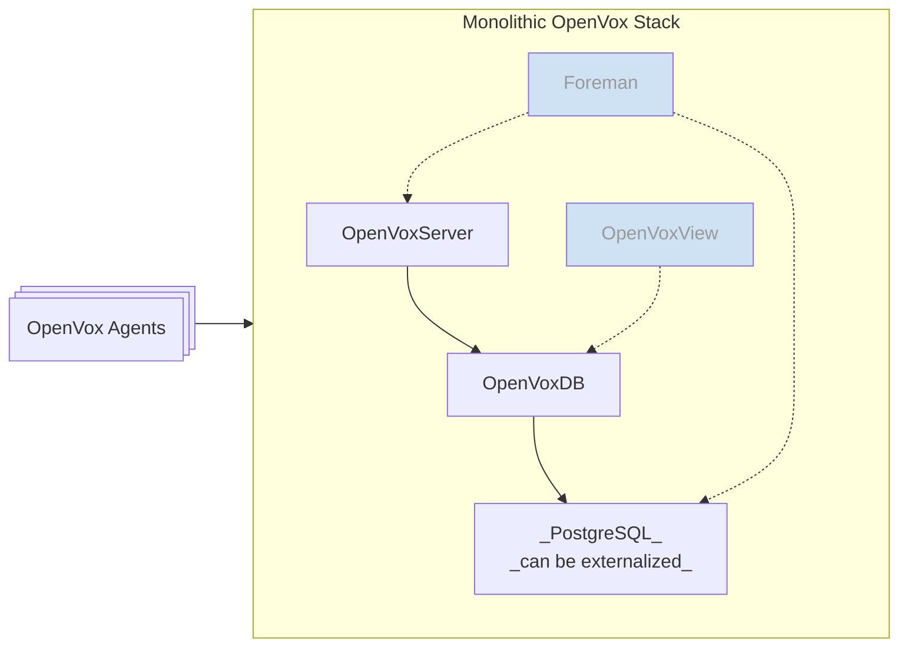
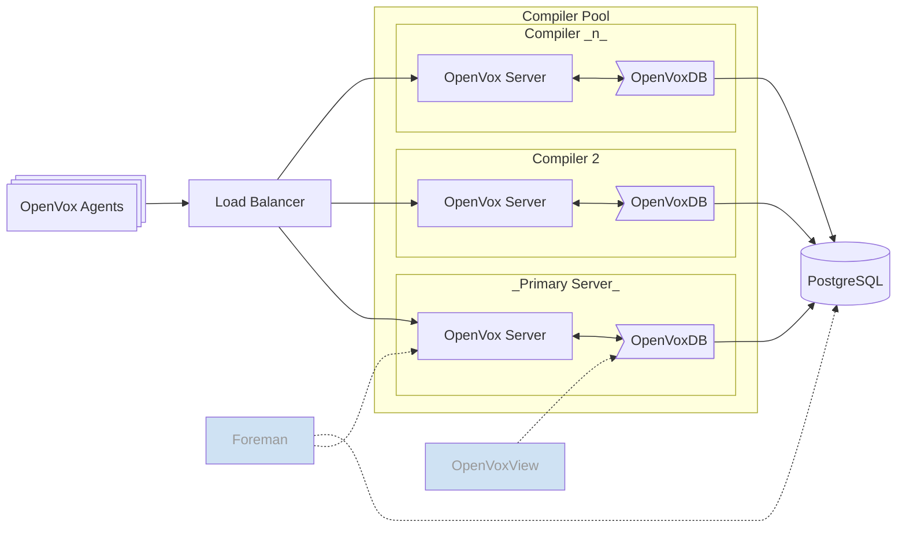
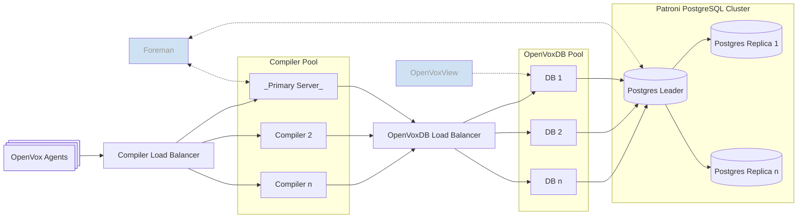

# Reference architecture for the OpenVox platform.

This is our [WIP] opinionated reference architecture for the OpenVox platform.
This implements the following node types. Each type also includes the agent service.

1. [OpenVox compiler nodes](#openvox-compilers):
    - OpenVox server
    - OpenVoxDB pointing to a central PostgreSQL node
    - Codebase deployment configured
    - Central reporting
    - Performance tuning profiles
1. [The *primary* OpenVox server](#primary-openvox-server):
    - Serves as the central certificate authority (CA)
    - Everything from [OpenVox compiler nodes](#openvox-compilers)
    - *Optional: Foreman web UI*
        - Redis Rails cache
        - Full two-way integration between OpenVox and Foreman
    - *Optional: [OpenVox View](https://github.com/voxpupuli/openvoxview) dashboard*
        - lightweight read only alternative to Foreman
    - *Optional: PostgreSQL server*
        - A monolithic server includes PostgreSQL, all other tiers externalize it.
1. [Load balancers](#load-balancers):
    - HAproxy balancer for either compilers or openvoxdb nodes
1. [PostgreSQL](#postgresql):
    - All OpenVoxDB nodes point to this server
    - If data HA is needed, this can be a Patroni managed cluster
    - Basic HA is achieved with regular data backups.
1. [OpenVox agent nodes](#openvox-agents):
    - Optional serverless configuration
        - Codebase deployment configured
        - Central reporting
1. [OpenVoxDB nodes](#openvoxdb) (for extra-large infrastructures):
    - OpenVoxDB service pointed at PostgreSQL cluster
    - Performance tuning profiles


## Configuration

First you should describe your infrastructure in Hiera data. The server names
do not have to be unique. For example, a monolithic OpenVox server will be the
primary, the foreman, and the openvoxdb. Leave any unused values blank.

```yaml
---
openvox_platform::primary_server: my.primary.example.com
openvox_platform::foreman_server: my.foreman.example.com # defaults to primary_server if blank
openvox_platform::openvoxdb: my.openvoxdb.example.com    # defaults to primary_server if blank
openvox_platform::postgresql: my.pgsql.example.com       # defaults to primary_server if blank

# If setting up a compiler pool
openvox_platform::loadbalancer: my.loadbalancer.example.com
# If -not- using OpenVoxDB, you must list all compiler nodes below
openvox_platform::compilers:
  - my.compiler1.example.com
  - my.compiler2.example.com
  - my.compilern.example.com

# If setting up an OpenVoxDB pool
openvox_platform::db_loadbalancer: my.dbloadbalancer.example.com

# deploying module and hiera repos
openvox_platform::control_repo: https://github.com/example/controlrepo
openvox_platform::hiera_repo: https://github.com/example/hierarepo # defaults to control_repo if blank
openvox_platform::reports:  # if you want reporting other than foreman and/or openvoxdb
  - additional
  - report
  - handlers
```

Then provision servers to match according to your tier needs. Classify each
node following the table below and ensure that they all have DNS names
matching the Hieradata infra description.

## Standard Monolithic Infrastructure

<details>
  <summary>Details</summary>

This tier is a single monolithic OpenVox server, also serving the Foreman Console
and OpenVoxDB. If you don't want the graphical interface, you can disable Foreman.
You can also choose to use the read-only OpenVoxView dashboard instead. If data HA
is required, the PostgreSQL service may be externalized to a Patroni managed cluster.

Provision:
* One monolithic server with no parameters.
* Agent nodes as desired.



</details>


## Large Infrastructure

<details>
  <summary>Details</summary>

This tier adds a load balanced compiler pool. A load balancer is placed in front of the
monolithic server and compiler nodes are added as needed. The primary and each compiler
runs OpenVoxDB configured to point to a single external PostgreSQL node.

### Optional configurations
* Foreman may run on the primary, on its own node, or be disabled.
* For a read-only view of your infra state, you may swap OpenVoxView for Foreman.
* If data HA is required, the PostgreSQL node may be a Patroni managed cluster.
    * If geographically dispersed distribution is required, Patroni can manage asynchronous replication.
* If you are node constrained, it's possible to run the PostgreSQL service on the primary server.

### Provision:
* One primary server; monolithic but with external PostgreSQL.
* One loadbalancer node.
* One PostgreSQL node.
* Compiler nodes as required; see the `pp_role` note below.
* Agent nodes as desired.



</details>

## Extra Large Infrastructure

<details>
  <summary>Details</summary>

The largest tier also load balances a pool of OpenVoxDB nodes and externalizes the
PostgreSQL backend to a Patroni managed cluster. This allows you to balance compilers
and OpenVoxDB nodes separately to respond to different scaling patterns. If geographically
dispersed data distribution is required, Patroni can manage asynchronous replication.

Provision:
* One loadbalancer node.
* Compiler nodes as required; see the `pp_role` note below.
    * ℹ️ one compiler is called the *primary* so that Foreman can point to it
* One Foreman or OpenVoxView node.
* One OpenVoxDB load balancer node.
* OpenVoxDB nodes as required; see the `pp_role` note below.
    * ℹ️ one OpenVoxDB is called the *primary* so that OpenVoxView can point to it
* One PostgreSQL leader node.
* PostgreSQL replica nodes as required.
    * If geographically dispersed distribution is required, Patroni can manage asynchronous replication.
* Agent nodes as desired.



</details>

| Server Role                | Classify with                             | notes                 |
|----------------------------|-------------------------------------------|-----------------------|
| _All infrastructure nodes_ | `openvox_platform`                        |                       |
| Monolithic OpenVox Server  | `openvox_platform::profile::monolithic`   |                       |
| Primary OpenVox Server     | `openvox_platform::profile::primary`      |                       |
| Foreman Server             | `openvox_platform::profile::foreman`      | ⚛️ can run on primary |
| OpenVoxView Server         | `openvox_platform::profile::openvoxview`  | ⚛️ can run on primary |
| PostgreSQL Server          | `openvox_platform::profile::postgresql`   | ⚛️ can run on primary |
| Compiler Loadbalancer      | `openvox_platform::profile::lb:compiler`  |                       |
| OpenVoxDB Loadbalancer     | `openvox_platform::profile::lb:openvoxdb` |                       |

### Load balancing

If you are configuring load balanced pools for compilers, OpenVoxDB, or PostgreSQL,
then provision them with the `pp_role` trusted fact as specified below, configured
***before requesting an OpenVox certificate!***. Ensure that these nodes are
classified with `openvox_platform`. You don't need to include the primary or monolithic
in this, but it won't hurt anything if you do.

| Server Role       | `pp_role`    |                  |
|-------------------|--------------|------------------|
| Compiler nodes    | `compiler`   | ⚠️ If you are not using OpenVoxDB, then also list each node in the compiler pool in the Hiera `openvox_platform::compilers` array |
| OpenVoxDB nodes   | `openvoxdb`  |                  |
| PostgreSQL nodes  | `postgresql` |                  |

### **[todo]** Serverless configuration

If you intend to run serverless then configure the `openvox_platform::serverless`
parameter to be `true`. This will cause each agent to clone the control and hiera
repos and update them prior to each run. It will honor the `environment` setting
in `puppet.conf` and enforce the manifest at

```bash
/etc/puppetlabs/code/environments/${environment}/manifests/site.pp
```

If you would like centralized reporting, you may use the `foreman`, `openvoxdb`,
and `postgresql` profiles to manage nodes and use the standard Hiera configuration
described above.


## Node Ownership

The profile classes are intended to have full ownership of a node.
You may add on things like Foreman smart proxies or plugins such as the
[Hiera Data Manager](https://github.com/betadots/hdm/), but don't also try to run
your company website or anything on it.

The `openvox_platform` class should be classified on all infrastructure nodes,
including your company webserver.


#### Advanced usage

If you would like to customize the Foreman, OpenVoxDB, or PostgreSQL beyond the
options provided, you may use the standard Hiera parameters for the underlying
component modules. If you have a [support plan](https://voxpupuli.org/openvox/support/)
then check with your provider for support options.


## Limitations

This module ***is not ready for production use*** yet. You are welcome to kick the
tires and poke & prod all you like, but please don't rely on it yet. It will be
heavily refactored as we flesh out how the platform will work. Parameters will
change and the way data & parameters are passed will change. Class names will be
refactored and may or may not have a 1-1 translation. This is currently only
regularly tested on x86 CentOS 9 until we set up proper pipeline testing.
