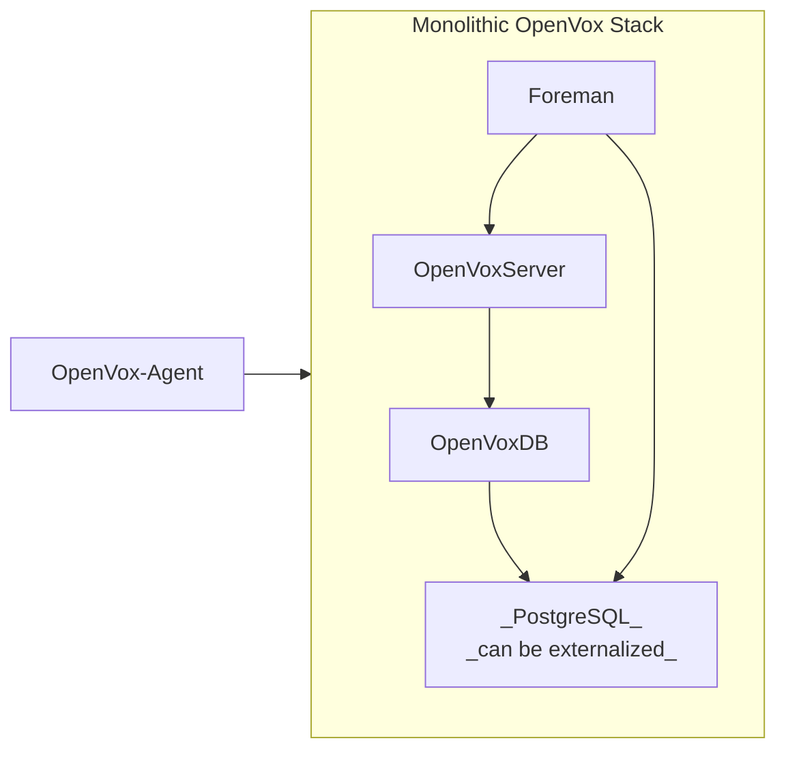
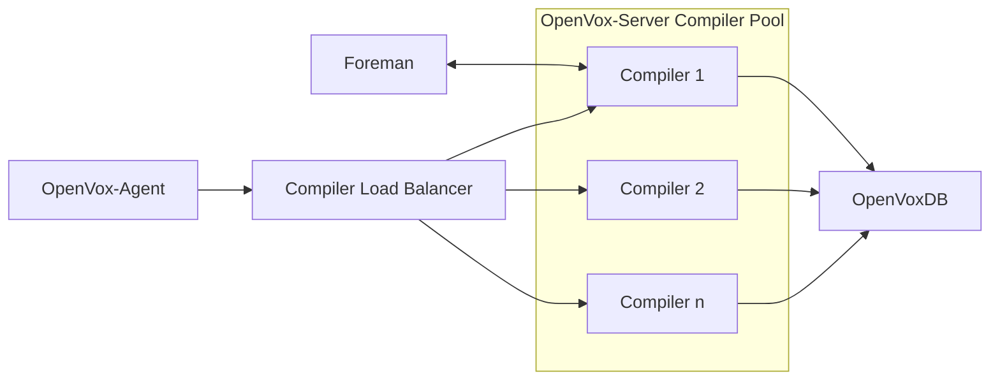
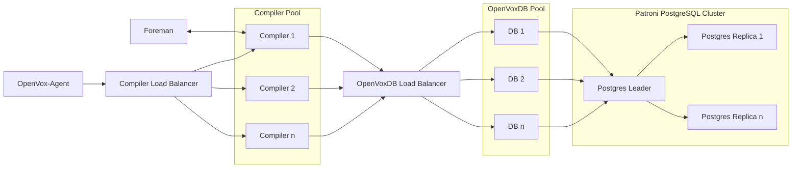

# Reference architecture for the OpenVox platform.

This is our [WIP] opinionated reference architecture for the OpenVox platform.
This implements the following node types:

1. [OpenVox compiler nodes](#openvox-compilers):
    - OpenVox agent
    - OpenVox server
    - Codebase deployment configured
    - Central reporting
    - Performance tuning profiles
1. [OpenVoxDB nodes](#openvoxdb):
    - OpenVox agent
    - OpenVoxDB
    - Performance tuning profiles
    - *Optional: PostgreSQL (can be externalized)*
        - Regular PostgreSQL backups, including both Foreman and OpenvoxDB tables
        - the preferred option of non-EOL vendor provided PostgreSQL
1. [The *primary* OpenVox server](#primary-openvox-server):
    - Everything from [OpenVox compiler nodes](#openvox-compilers)
    - Everything from [OpenVoxDB nodes](#openvoxdb)
    - *Optional: Foreman web UI*
        - Redis Rails cache
        - Full two-way integration between OpenVox and Foreman
    - *Optional: [OpenVox View](https://github.com/voxpupuli/openvoxview) dashboard*
        - lightweight read only alternative to Foreman
1. [Load balancers](#load-balancers):
    - HAproxy balancer for either compilers or openvoxdbs
1. [OpenVox agent nodes](#openvox-agents):
    - OpenVox agent
    - Optional serverless configuration
        - Codebase deployment configured
        - Central reporting

## Configuration

First you should describe your infrastructure in Hiera data. The server names
do not have to be unique. For example, a monolithic OpenVox server will be the
primary, the foreman, and the openvoxdb. Leave any unused values blank.

```yaml
---
openvox_platform::primary_server: my.primary.example.com
openvox_platform::foreman_server: my.foreman.example.com
openvox_platform::openvoxdb: my.openvoxdb.example.com

# If setting up a compiler pool
openvox_platform::loadbalancer: my.loadbalancer.example.com
# If -not- using OpenVoxDB, you must list all compiler nodes below
openvox_platform::compilers:
  - my.compiler1.example.com
  - my.compiler2.example.com
  - my.compilern.example.com

# If setting up an OpenVoxDB pool
openvox_platform::db_loadbalancer: my.dbloadbalancer.example.com

# If configuring an external PostgreSQL server/cluster
openvox_platform::pgsql_leader: my.pgsql_leader.example.com
```

Then provision servers to match according to your tier needs. Classify each
node following the table below and ensure that they all have DNS names
matching the Hieradata infra description.

## Standard Infrastructure

<details>
  <summary>Details</summary>

This tier is a single monolithic OpenVox server, also serving the Foreman Console
and OpenVoxDB. If you don't want the graphical interface, you can disable Foreman.
You can also choose to use the read-only OpenVoxView dashboard instead.

Provision:
* One monolithic server with no parameters.
* Agent nodes as desired.



</details>


## Large Infrastructure

<details>
  <summary>Details</summary>

This tier adds a load balanced compiler pool. The Foreman Console is on a separate
node, pointing at the primary compiler. OpenVoxDB is separate node and all compilers
are connected to it. If you don't want the graphical interface, you can disable Foreman.
You can also choose to use the read-only OpenVoxView dashboard instead.

Provision:
* One primary server with foreman and openvoxdb disabled.
* One loadbalancer node.
* Compiler nodes as required; see the `pp_role` note below.
* One Foreman node.
* One OpenVoxDB node.
* Agent nodes as desired.



</details>

## Extra Large Infrastructure

<details>
  <summary>Details</summary>

The largest tier also load balances a pool of OpenVoxDB nodes and externalizes the
PostgreSQL backend to a Patroni managed cluster

Provision:
* One primary server with foreman and openvoxdb disabled.
* One loadbalancer node.
* Compiler nodes as required; see the `pp_role` note below.
* One Foreman node.
* One OpenVoxDB load balancer node.
* OpenVoxDB nodes as required; see the `pp_role` note below.
* One PostgreSQL leader node
* PostgreSQL replica nodes as required.\
* Agent



</details>

| Server Role                | Classify with                             | parameters         |
|----------------------------|-------------------------------------------|--------------------|
| _All infrastructure nodes_ | `openvox_platform`                        |                    |
| Monolithic OpenVox Server  | `openvox_platform::profile::primary`      | _none_             |
| Primary OpenVox Server     | `openvox_platform::profile::primary`      |                    |
| --- without Foreman        |                                           | `foreman=false`    |
| --- without OpenVoxDB      |                                           | `openvoxdb=false`  |
| Foreman Server             | `openvox_platform::profile::foreman`      |                    |
| OpenVoxDB Server           | `openvox_platform::profile::database`     |                    |
| Compiler Loadbalancer      | `openvox_platform::profile::lb:compiler`  |                    |
| OpenVoxDB Loadbalancer     | `openvox_platform::profile::lb:openvoxdb` |                    |
| PostgreSQL Leader          | `openvox_platform::profile::pg_leader`    |                    |


If you are configuring load balanced pools for compilers, OpenVoxDB, or PostgreSQL,
then provision them with the `pp_role` trusted fact as specified below, configured
***before requesting an OpenVox certificate!***. Ensure that these nodes are
classified with `openvox_platform`.

| Server Role       | `pp_role`    |                  |
|-------------------|--------------|------------------|
| Compiler nodes    | `compiler`   | _see notes below |
| OpenVoxDB nodes   | `openvoxdb`  |                  |
| PostgreSQL nodes  | `postgresql` |                  |

> ⚠️ If you are not using OpenVoxDB, then also list each node in the compiler pool
> in the Hiera `openvox_platform::compilers` array.


> ⚠️ **This module is still under heavy development** and the interface is expected
> to change drastically. Do not take configuration choices we've made with this module
> as recommendations (yet). See [#limitations](#limitations) and don't use the module yet.
> Contributions and suggestions are very happily accepted.


## Node Ownership

The `server` and `compiler` profiles are intended to have full ownership of a node.
You may add on things like Foreman smart proxies or plugins such as the
[Hiera Data Manager](https://github.com/betadots/hdm/), but don't also try to run
your company website or anything on it.


## Usage

### Primary OpenVox Server

This is the most common use of this module. Simply include it on a node to
configure a primary server with OpenVoxDB and a standard Foreman configuration.

```puppet
include openvox_platform
```

You may also choose to disable Foreman or OpenVoxDB to get these standard stacks:

| Foreman | OpenVoxDB | standard configuration          |
|:-------:|:---------:|---------------------------------|
|   ✅    |    ✅     | primary OpenVox server          |
|   ⛔️    |    ✅     | no GUI primary OpenVox server   |
|   ⛔️    |    ⛔️     | secondary OpenVox compiler node |
|   ✅    |    ⛔️     | no OpenVoxDB (not recommended)  |

There are several optional configuration parameters you may set. Please see the
class documentation for more information.

#### Advanced usage

If you would like to customize the Foreman, OpenVoxDB, or PostgreSQL beyond the
options provided, you may use the standard Hiera parameters for the underlying
component modules. If you have a [support plan](https://voxpupuli.org/openvox/support/)
then check with your provider for support options.

### Secondary OpenVox Compilers

**[todo]** To configure a node as a secondary compiler, just classify it without
enabling Foreman or OpenVoxDB. It will configure itself with a copy of the Puppet
codebase and to send reports back to the primary server.

```puppet
class { 'openvox_platform':
  foreman  => false,
  puppetdb => false,
}
```

### OpenVox Agents

**[todo]** Use the `openvox_platform::agent` class to configure agents. You should
include this on all nodes in your infrastructure. If you intend to run serverless
then specify a `control_repository` and optionally an update frequency.


## Limitations

This module ***is not ready for production use*** yet. You are welcome to kick the
tires and poke & prod all you like, but please don't rely on it yet. It will be
heavily refactored as we flesh out how the platform will work. Parameters will
change and the way data & parameters are passed will change. Class names will be
refactored and may or may not have a 1-1 translation. This is currently only
regularly tested on x86 CentOS 9 until we set up proper pipeline testing.
